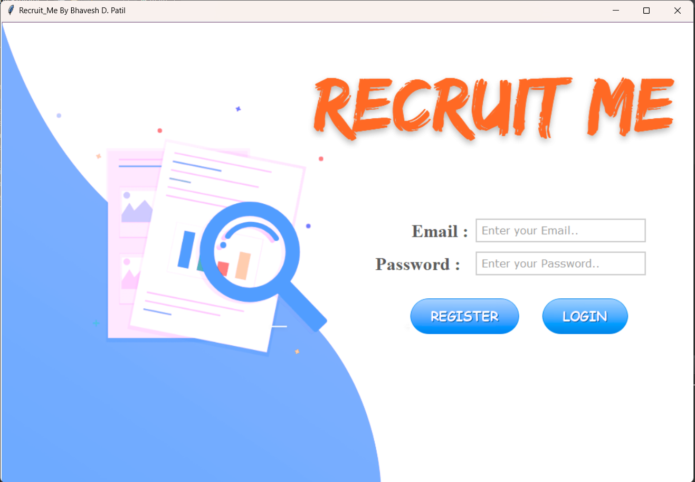
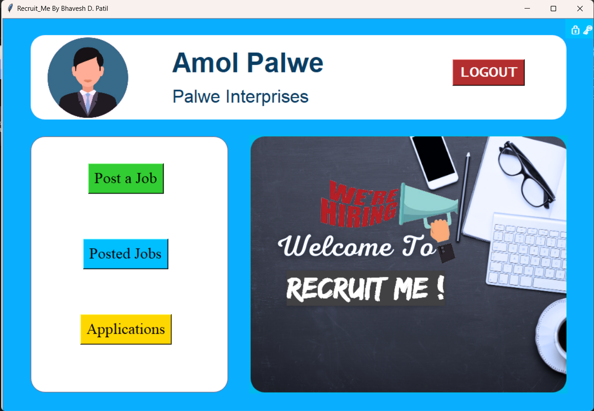
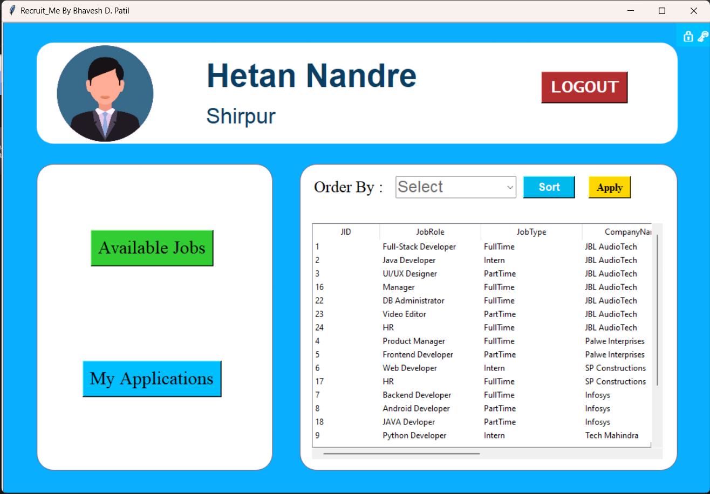
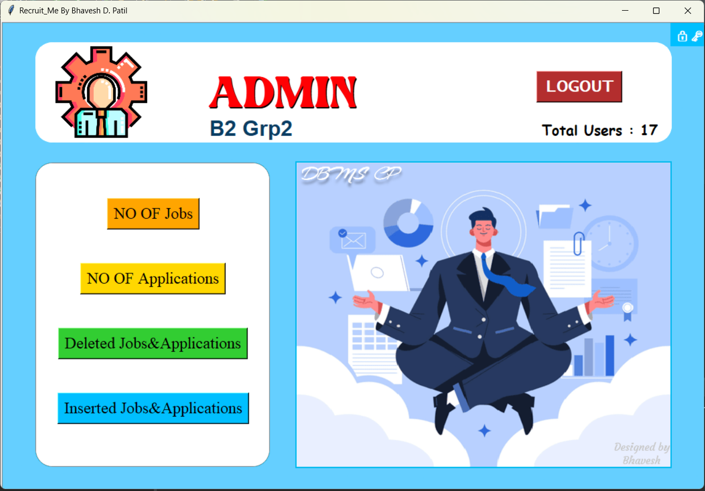

  

# # Recruit-ME


###  DBMS Mini-project: Recruitment Management System.💫✨


# Features
- ***Python + MYSQL using mysql.connector library***
- ***Recruiter and Client Panel***
- ***ADMIN Panel for logs***
- ***Change Password***
- ***Beautiful UI using tkinter***


### :rocket:Glimpse :dizzy::dizzy:<br><br>






## Setup

##### Clone the repository

```bash
git clone this repo
```

##### Move to the desired folder

```bash
cd RecriutMe
```

##### Make sure MYSQL is running on your System . Now move to `creds.py` inside modules folder and replace the value of `user_pwd`
```
 user_pwd = "your mysql password"
```
##### Now we're almost done so to create the required schema in your machine simply run 
```bash
python db_init.py
```

##### After setting up the schema, to run simply write
```bash
python main.py
```
---

## Future-Scope
- More Features can be added like we can make Resume on it and can share to nearby recruiters
-  Super-User(Admin) Panel For more Features.
- many more ...

### If you encounter any difficulty running it, feel free to contact on my email :smile:

### If you liked our work do give us a star :star::star::star: It Encourages us to do more :wink: :dizzy:
